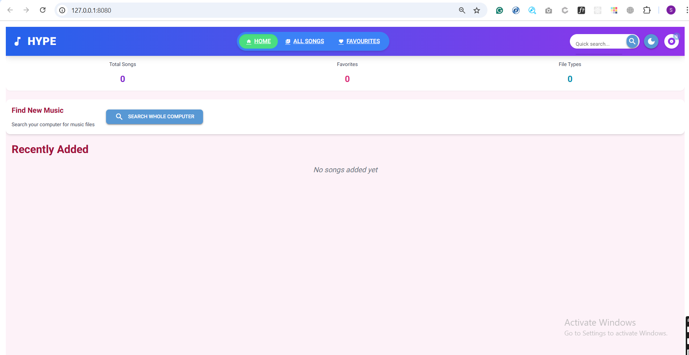
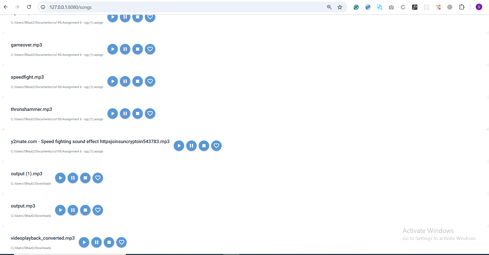
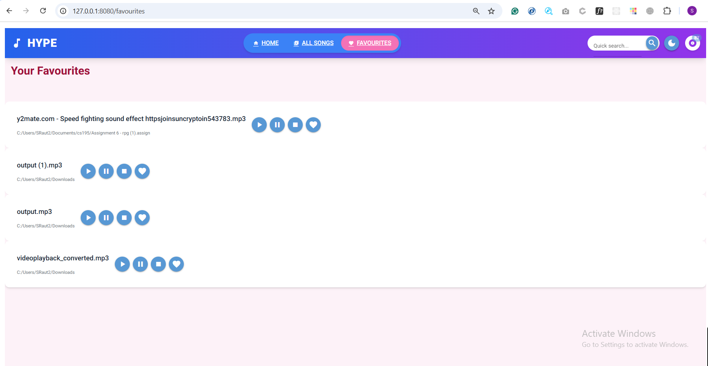

# 🎵 HYPE – Music Player Application (Built with NiceGUI)
This project is developed using Python's **NiceGUI** library.

## 📌 About the Project

The name of our application is **HYPE**.
It is a simple and neat **music player app** which allows users to:

* Play music files stored locally on their computer.
* Manage their favourite songs.
* Switch between light and dark mode for better viewing experience.

---

## 📁 Pages Available in the App

### 🏠 Home Page (`/`)

This is the **default screen** you will see after running `frontend.py`.



* On first-time use, **no songs will be visible** because the `data.json` file (which stores music file information) does not exist yet.
* There is a button named **"SEARCH WHOLE COMPUTER"**.
* On clicking this button, a function from `actions/search.py` will execute.
* It uses Python's `os` module to **search your entire computer** for music files with `.mp3` extension.
* Once found, the data is stored in **`data.json`** in proper JSON format.
* After this step, HYPE will begin displaying all your songs in the interface.

---

### 🎶 Songs Page (`/songs`)



On this page, users can:

* View the **complete list of songs** from `data.json`.
* Play, pause, and stop songs.
* Mark songs as **favourite** or **remove from favourites**.
* All favourites are saved inside the **`favourites.json`** file.

---

### ❤️ Favourites Page (`/favorites`)



* This page displays only those songs which the user has added to **favourites**.
* Makes it easy to access your most loved tracks quickly.

---

## 🌗 Extra Features

* You can **toggle between Light Mode and Dark Mode** for better comfort depending on your environment.

---

## 🚀 How to Run

1. Make sure you have Python installed.
2. Install NiceGUI by running:

   ```
   pip install nicegui
   ```
3. Run the app using:

   ```
   python frontend.py
   ```
4. Visit `http://localhost:8080` in your browser.


## 🙏 Thank You!

We hope you enjoy using **HYPE**.
This is a small project but built with passion and purpose.
Suggestions and feedback are always welcome!
